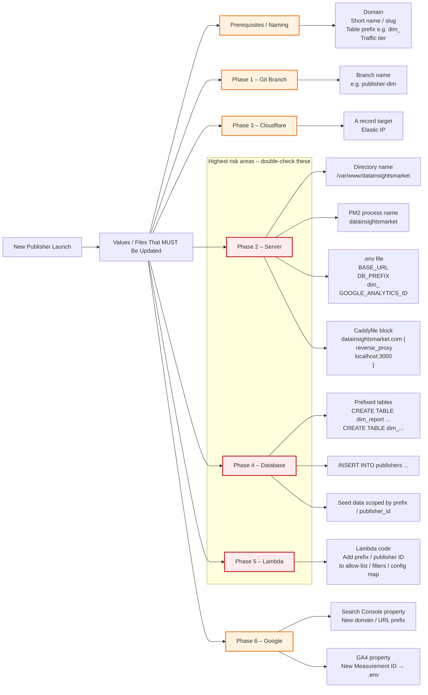

```mermaid
flowchart LR
    NewLaunch[New Publisher Launch] --> MustChange[Values / Files That MUST Be Updated]

    MustChange --> A[Prerequisites / Naming]
    MustChange --> B[Phase 1 – Git Branch]
    MustChange --> C[Phase 2 – Server]
    MustChange --> D[Phase 3 – Cloudflare]
    MustChange --> E[Phase 4 – Database]
    MustChange --> F[Phase 5 – Lambda]
    MustChange --> G[Phase 6 – Google]

    A --> A1[Domain\nShort name / slug\nTable prefix e.g. dim_\nTraffic tier]
    B --> B1[Branch name\ne.g. publisher-dim]
    C --> C1[Directory name\n/var/www/datainsightsmarket]
    C --> C2[PM2 process name\ndatainsightsmarket]
    C --> C3[.env file\nBASE_URL\nDB_PREFIX\ndim_\nGOOGLE_ANALYTICS_ID]
    C --> C4["Caddyfile block\ndatainsightsmarket.com {\n  reverse_proxy localhost:3000\n}"]
    D --> D1[A record target\nElastic IP]
    E --> E1[Prefixed tables\nCREATE TABLE dim_report ...\nCREATE TABLE dim_...]
    E --> E2[INSERT INTO publishers ...]
    E --> E3[Seed data scoped by prefix / publisher_id]
    F --> F1[Lambda code\nAdd prefix / publisher ID\nto allow-list / filters / config map]
    G --> G1[Search Console property\nNew domain / URL prefix]
    G --> G2[GA4 property\nNew Measurement ID → .env]

    subgraph "Highest risk areas – double-check these"
        C
        E
        F
    end

    classDef critical fill:#ffebee,stroke:#c62828,stroke-width:2.5px
    class C,E,F critical

    classDef medium fill:#fff3e0,stroke:#ef6c00,stroke-width:2px
    class A,B,D,G medium
```
